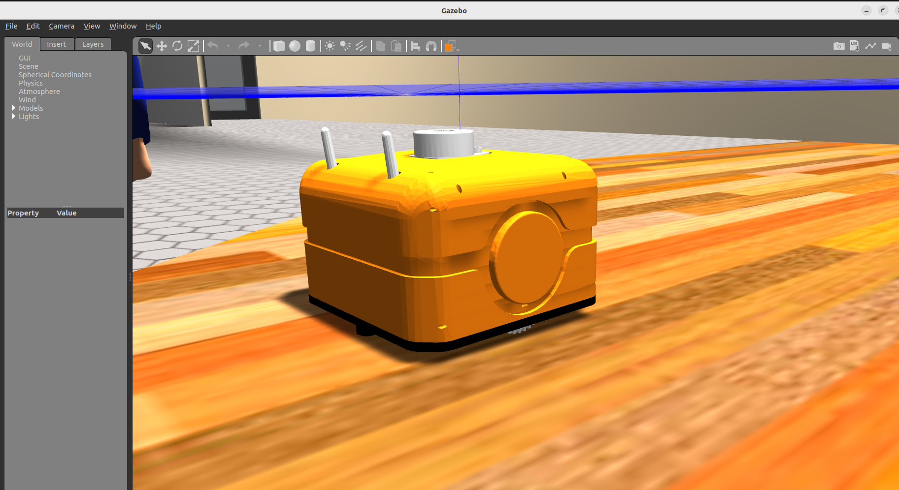

## rom2109 Autonomous Mobile Robot ( Start Project - Sepetmber 2021)

#### ROS2 humble အတွက် packageများ
ros2 launch rom2109_description description.xacro.launch.py use_sim_time:=true

#### Install ပြုလုပ်ခြင်း ( Hardware Robot , Simulation Robot ) 
```
sudo apt install -y ros-humble-gazebo-ros* 
sudo apt install -y ros-humble-ros2-control*
sudo apt install -y ros-humble-controller-*
cd your/workspace/src
git clone git@github.com:ROM-robotics/rom2109.git
cd your/workspace && colcon build --symlink-install && source install/setup.bash
```

rom2109_tall ကို ကိုပြည့်စုံအောင် design ဆွဲပြီး rom2109_bot ကို ကိုစည်သူရဲထွန်း design ဆွဲပြီး မြန်မာပြည်တွင် တပ်ဆင်သည်။

#### အသုံးပြုနည်းများ
<a href="https://github.com/ROM-robotics/rom2109/blob/humble-devel/rom2109_description/README.md">rom2109_description အသုံးပြုနည်း </a> 

<a href="https://github.com/ROM-robotics/rom2109/blob/humble-devel/rom2109_description/README.md">rom2109_gazebo အသုံးပြုနည်း </a> 

<a href="www.google.com">rom2109_nav2 အသုံးပြုနည်း </a> 

<a href="www.google.com">rom2109_autonomy အသုံးပြုနည်း </a> 

<a href="www.google.com">Real Robot အသုံးပြုနည်း </a> 

