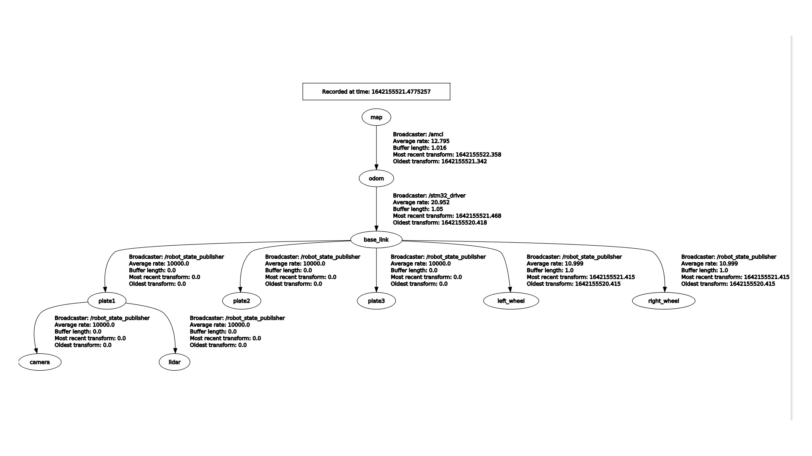

# rom2109_controller-release is base on ROM2109_controller repo

forward , rotate , calibrate ကို robot computer တွင် publish ပါ ။ ( cause of network traffic )

ပြသနာ
right motor stop နောက်ကျသည်။ pid 0 rpm ဖြစ်ဖို့ ေနာက်ကျသည်ဟု ယူဆသည်။
solution 1: left motor 0 ဖြစ်တာနဲ့ right motor ကို 0  ပေးကြည့်ရာ , ေနာက်ကျပေမဲ့ သိပ် ကိတ်စမရှိ။ ပြသနာက DMA မှာ ေANGULAR VEL တန်ဖိုး RANDOM ဖြစ်တာမို့ FIXED ပြီးပြီ။

